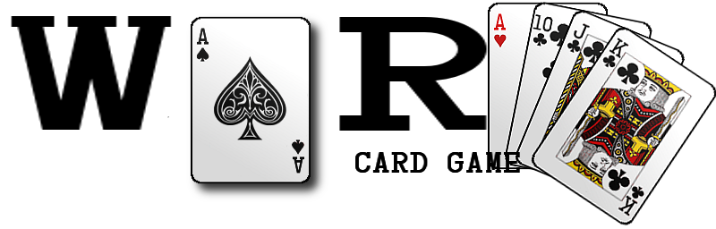

# War Code Along

Let's use some of the JavaScript skills we've learned over the past couple of days to build another game in the console. This time, we'll build War.

## Preparation

Just like with Rock Paper Scissors, the first step we'll take in building war is to write some pseudocode.

Next, we'll create our files and do the basic set up. Go into your terminal:

```bash
cd ~/Desktop
mkdir war
cd war
mkdir js
touch index.html js/app.js
```

Open the project in Sublime Text, then add boilerplate HTML to your HTML file. Source in your JS file and check the connection in the browser.

## Code Along

> Note: We're going to do this code along by following the pseudocode we wrote together, so we might not go in the exact order of this markdown. The rest of this markdown serves as a reference for *one way* we could code this game.

#### Build Player Objects

Each of our players has a name and a hand. Instead of making four separate variables, we can make two player objects instead. We can use a constructor function for this.

```js
function Player(name) {
	this.name = name
	this.hand = []
}
```

`Player` will create a player with a name and an empty hand.

Let's use `prompt` to get both players' names and create Player objects. We can do this with a function.

```js
function getPlayerNames() {
	var user1 = prompt('Player 1, please enter your name')
	player1 = new Player(user1)
	var user2 = prompt('Player 2, please enter your name')
	player2 = new Player(user2)
}
```

Let's call `getPlayerNames` right away so that we have the player objects ready for the game.

#### Build a Deck

Instead of defining each card object individually using object literal syntax, we can write a constructor function and build a deck programatically.

```js
function Card(suit, value) {
	this.suit = suit
	this.value = value
	this.declare = function() {
		return (value + ' of ' + suit)
	}
}

var suits = ['spades', 'hearts', 'clubs', 'diamonds']
var vals = [2, 3, 4, 5, 6, 7, 8, 9, 10, 'Jack', 'Queen', 'King', 'Ace']
var deck = []

function newDeck() {
	for(var i = 0; i < suits.length; i++) {
		for(var j = 0; j < vals.length; j++) {
			deck.push(new Card(suits[i], vals[j]))
		}
	}
}
```
Check out the function by typing it into the console. Since we know we'll need a deck to start the game, we can go ahead and call the `newDeck` function in our file so that it runs when the page loads.

Right now our deck is in order. Let's write a function to shuffle the deck.

```js
function shuffle() {
	var shuffledDeck = []
	var length = deck.length
	for (var i = 0; i < length; i++) {
		var pick = Math.floor(Math.random() * deck.length)
		shuffledDeck.push(deck.splice(pick, 1)[0])
	}
}
```

We can also write a function to deal the cards.

```js
function deal(cards) {
	player1.hand = cards.splice(0, 26)
	player2.hand = cards
}
```
We can call `deal` inside `shuffle` and use `shuffledDeck` as an argument.

```js
deal(shuffledDeck)
```

Just like we created the deck on page load, we can shuffle and deal on page load, too. Let's call `shuffle` inside `newDeck`.

#### Game Logic

First, let's build a `battle` function, which will take one card from each player's hand and compare the values. The player with the highest card will take both cards. If the values are the same, there will be a war!

```js
function battle() {
	var card1 = player1.hand.shift()
	var card2 = player2.hand.shift()
	if (vals.indexOf(card1.value) > vals.indexOf(card2.value)) {
		player1.hand.push(card1, card2)
		console.log(player1.name + ' wins ' + card2.declare() + ' with ' + card1.declare())
	} else if (vals.indexOf(card2.value) > vals.indexOf(card1.value)) {
		player2.hand.push(card1, card2)
		console.log(player1.name + ' wins ' + card1.declare() + ' with ' + card2.declare())
	} else if (vals.indexOf(card1.value) === vals.indexOf(card2.value)) {
		console.log(player1.name + ' played ' + card1.declare() + ' and ' + player2.name + ' played ' + card2.declare() + '. THIS MEANS WAR!')
		// call a war function here
	}
	console.log(player1.name + ' has ' + player1.hand.length + ' cards.')
	console.log(player2.name + ' has ' + player2.hand.length + ' cards.')
	// check for a winner
}
```

Let's pause for a moment and talk about the `debugger` keyword.

> You can set breakpoints in the code with the `debugger` keyword. If the console is open and the interpreter is going through a line in the code that contains `debugger`, then the console will highlight this line and the console will be in the context of the `debugger`.

> Let's add a debugger where we will be calling a war function.

> The DevTools console drawer will allow you to experiment within the scope of where the debugger is currently paused. Hit the **Esc** key to bring the console into view. The Esc key also closes this drawer.

> We can use this to help us when we're not sure of the value of a variable at a specific moment in our code.

> Let's keep this in mind for later.

Now we need to fill out how to check for a winner. If one player has no cards left, then the other player wins.

```js
function checkForWin() {
	if (player1.hand.length === 0 || player2.hand.length === 0) {
		var winner = player1.hand.length > 0 ? player1.name : player2.name
		console.log(winner + ' wins! Redealing cards...')
		newDeck()
	}
}
```
We can deal again by calling `newDeck`!

The most important part of war is, well, the *war*.

```js
var pot = []

function war(card1, card2) {
	pot.push(card1, card2)
	// figure out how many cards each player can wager
	if (player1.hand.length > 0 && player2.hand.length > 0) {
		var warCard1 = player1.hand.shift()
		var warCard2 = player2.hand.shift()
		if (vals.indexOf(warCard1.value) > vals.indexOf(warCard2.value)) {
			player1.hand.push(warCard1, warCard2)
			pot.forEach(function(prize){
				player1.hand.push(prize)
			})
			pot = []
		} else if (vals.indexOf(warCard2.value) > vals.indexOf(warCard1.value)) {
			player2.hand.push(warCard1, warCard2)
			pot.forEach(function(prize){
				player2.hand.push(prize)
			})
			pot = []
		} else if (vals.indexOf(warCard1.value) === vals.indexOf(warCard2.value)) {
			console.log(player1.name + ' played ' + warCard1.declare() + ' and ' + player2.name + ' played ' + warCard2.declare() + '. THIS MEANS WAR!')
			war(warCard1, warCard2)
		}
	}
}
```

If a player has at least 4 cards, then they will wager 3. If they have 1, 2, or 3 cards, they will wager all but one and use the last card for the big battle.

```js
function wager(player) {
	var wagerCount
	if (player.hand.length > 3) {
		wagerCount = 3
	} else if (player.hand.length > 0) {
		wagerCount = player.hand.length - 1
	} else {
		wagerCount = 0
	}
	for (var i = 0; i < wagerCount; i++) {
		pot.push(player.hand.shift())
	}
}
```

Lastly, let's add a method to list out the cards in the pot so that we can see them in the console.

```js
function declarePot() {
	var list = []
	pot.forEach(function(card) {
		list.push(card.declare())
	})
	return list.join(', ')
}
```

Then add these lines underneath where the wagers are made inside `war`.

```js
var potList = declarePot()
console.log('The pot at stake is ' + potList)
```

## Conclusion

Now that we have our game working in the console, you have a good foundation for fleshing out the game by adding HTML, CSS, and jQuery!